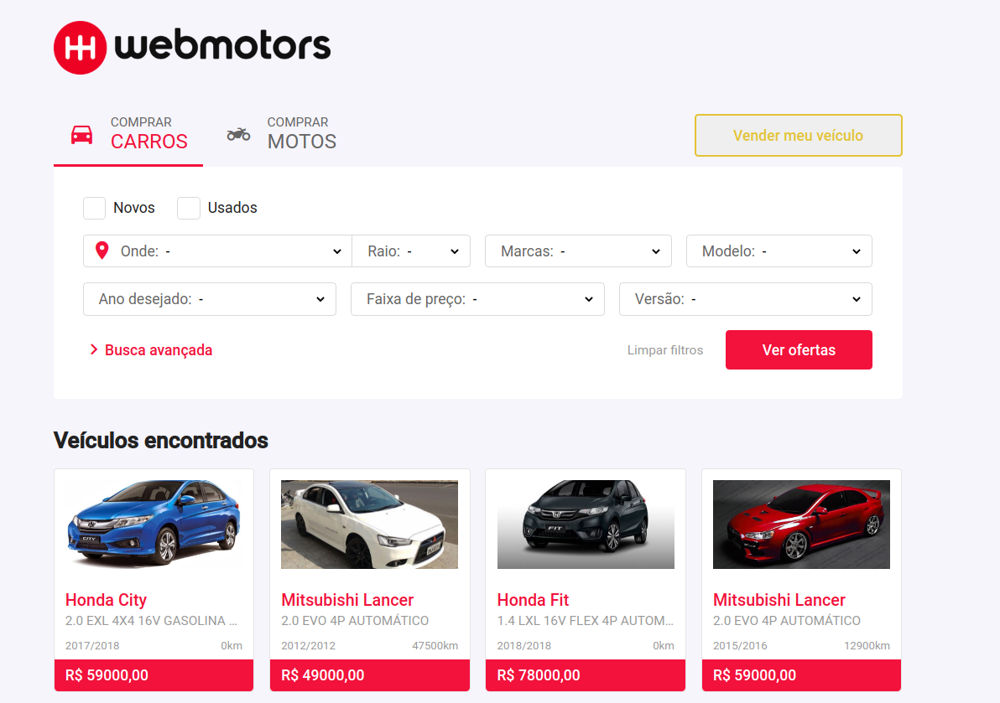

<div align="center">
  
  <p>
    Interface do antigo website da Webmotors recriada, principalmente, com ReactJS, com o objetivo de praticar e colocar a prova todo conhecimento acumulado.
  </p>
</div>
<div align="center" style="margin: 20px 0">
  
  
  <a href="https://github.com/Gabrielhsm20/webmotors-ui/commits/master" target="_blank">
    
  </a>
  <a href="https://github.com/Gabrielhsm20/webmotors-ui/issues" target="_blank">
    
  </a>
</div>

## 💻 Preview
<div align="center">
  
</div>

## 🛠 Ferramentas

- [React](https://reactjs.org/)
- [Styled Components](https://styled-components.com/)

## 🚀 Instalação
```bash
$ git clone https://github.com/Gabrielhsm20/webmotors-ui.git
$ cd webmotors-ui
$ npm install
$ npm start
```
